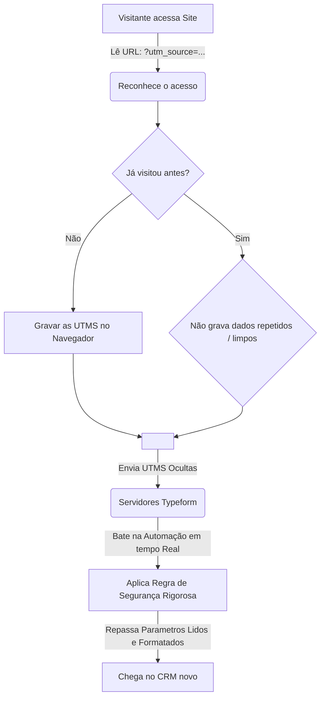

<div align="center">
  <h1>Ebulição × Ticto — Landing Page </h1>
  <p><em>Teste Técnico — Gerente de Automações</em></p>

  [](#)
  [](#)
  [](#)
  [](#)
  [](#)
</div>

---

Landing page de captura de leads para o **Ebulição** (evento Outlier Experience da Ticto), com integração direta **Typeform → HubSpot CRM**. Entregue como teste técnico da vaga de **Gerente de Automações**.

**Links Principais:**
- **Produção:** [ticto-outlier-lp.vercel.app](https://ticto-outlier-lp.vercel.app/)
- **Repositório:** [GitHub - ticto-ebulicao-lp](https://github.com/johansabent/ticto-ebulicao-lp)
- **Teste (Parâmetros Rastreáveis):** [Link de Teste (UTMs)](https://ticto-outlier-lp.vercel.app/?utm_source=linkedin&utm_medium=organic&utm_campaign=outlier2025&utm_content=hero-cta&utm_term=evento-presencial&sck=abc123&src=review)
- **Briefing Original:** [`docs/teste-tecnico-automacoes.md`](docs/teste-tecnico-automacoes.md)

> [!IMPORTANT]
> **Sobre o uso do Typeform:** O briefing pedia o uso do YayForms, porém o **Gustavo (Head de Marketing)** me confirmou via WhatsApp que a Ticto **utiliza o Typeform na prática** (e o Yayforms foi descontinuado neste mês). A mudança foi combinada previamente, então o teste já está modelando a estrutura real usada por vocês.

---

## Entregáveis Concluídos

| Critério | Status |
| :--- | :--- |
| **Página no ar** | Hospedada gratuitamente e funcionando pela Vercel. |
| **Código aberto** | Repositório público no GitHub. |
| **Parâmetros de Tracking** | As UTMs do link acima ficam gravadas no navegador (`localStorage`) e são enviadas dentro dos campos ocultos no formulário. |
| **Integração no CRM** | Os contatos novos chegam bonitinhos no **HubSpot**. Tentativas de contatos falsos e repetidos são tratados para que não gerem erro na tela ou corrompam a conta. |
| **Documentação clara** | O passo a passo para testar, minhas decisões e melhorias estão todas aqui. |

---

## Integração HubSpot (+ Motivo da Troca)

> [!NOTE]
> **Mudança de Rota:** Construí o sistema voltado para o CRM pedido originalmente na vaga. Aconteceu que ele barra o cadastro de contatos novos (Leads através de API) nos planos Free, exigindo pagar pelo upgrade. Para demonstrar a solução funcionando de ponta a ponta sem esbarrar no bloqueio deles, mudei rapidamente a ponta final da automação para o HubSpot, onde uso do plano gratuito.

A parte legal é que, como o projeto foi muito bem estruturado, modificar o envio para um CRM novo só precisou de mudanças em **um único arquivo**, não precisei reescrever dezenas de coisas, facilitando em cenários onde a própria Ticto decidisse testar serviços diferentes em produção.

### Lidando com envios Repetidos (Contatos Duplicados)
O HubSpot identifica automaticamente se um contato já existe usando o e-mail cadastrado. Quando uma pessoa (ou um erro de internet) tentar reenviar o formulário, o sistema receberá um aviso, mas absorveremos isso como "Sucesso". Dessa forma, se algum serviço parceiro engasgar e mandar repetições, não corremos o risco do lead original se danificar ou acusar mensagem de erro pro seu usuário na tela do site.

---

## Por que fiz a integração com Código Direto (e afastei o Zapier)?

Construir o webhook recebendo tudo via "Next.js" ao invés de pular rapidamente usar ferramentas "low-code" como Zapier ou Make trouxe vantagens fundamentais:

- **Detecção Visual de Erros:** Usando ferramentas como TypeScript para gerir a automação, se houver qualquer desvio de campos configurados (nome de parâmetro errado), o programa grita um erro para eu corrigir ainda aqui no meu editor, não dias depois do portal no ar de cara com o cliente.
- **Transação Isolada e "De Graça":** Em vez de pagar pro Zapier a cada tarefa "processada" caso o projeto crescesse, a hospedagem de código executa gratuitamente no servidor (limites absurdamente grandes via Fluid Compute).
- **Segurança Premium:** Usei Autenticação segura via HMAC. Resumindo: a nossa inteligência no código checa assinaturas matemáticas que garantem que **só** requisições assinadas com o segredo compartilhado do Typeform são aceitas. Curiosos de internet tentando poluir seus Leads serão barrados!
- **100% Testável:** Construí mais de 60 verificações por testes contínuos automatizados. Modificarmos o campo não exige voltar e ficar clicando de página em página. Tudo é validado com código autônomo.

---

## Fluxo da Aplicação & Salvação de Parâmetros (UTMs)



---

## Resumo dos Reforços de Segurança Adicionados

| Adição / Regra | O que isso faz? |
| :--- | :--- |
| **Protocolo HMAC Rápido** | Impede mensagens de intrusos e rejeita requisições malformadas na fila de entrada. |
| **Limite de Tamanho de Leitura (64KB)** | Corta o carregamento de payloads excessivos instantaneamente, prevenindo exaustão de memória por requisições maliciosas ou malformadas. |
| **Validade Expansível de Recibo (Replay Window)** | O webhook aceita eventos de até 48 horas atrás (tolerância para reentregas legítimas), mas rejeita qualquer requisição fora dessa janela ("Replay Attack"). |
| **Ocultamento e Proteção de Dados (PII)** | Telefones e e-mails de clientes nunca são salvos nas listas de "Registro de erros e logs" por inteiro (Sempre `J***` e `j***@domain.com`). |

---

## Comandos Técnicos e Tech Stack

- **Core:** Next.js 16.2 (App Router), React 19, TypeScript 6.0.
- **Design:** Tailwind CSS v4, Lucide React e clsx/tailwind-merge.

Para fazer rodar de forma isolada na sua máquina, utilize os logs baseados na biblioteca `.env.example`:

```env
HUBSPOT_PRIVATE_APP_TOKEN=    # Token Pessoal - HubSpot
TYPEFORM_WEBHOOK_SECRET=      # Senha Cadastrada no Webhook lá no portal do Typeform
TYPEFORM_FORM_ID=FbFMsO5x     # O Front cruza a validação com a do Typeform (Formulário)
NEXT_PUBLIC_SITE_URL=         # A URL onde você está rodando o teste (Canônico)
NEXT_PUBLIC_TYPEFORM_FORM_ID= # Reforço Client-Side 
```

**Comandos Locais Iniciais**
```bash
# Rodar o código Web
pnpm install
pnpm dev

# Quality Gate (Rotinas Automatizadas)
pnpm lint            # Verificação com as regras do eslint
pnpm typecheck       # Verifica tipografia e estrutura de componentes
pnpm test            # Aciona todos os 60+ Testes que escrevi
pnpm check:secrets   # Varre os arquivos verificando vazamento de suas senhas!
```

---

## Pontos de Melhoria Futura (Fora das 72h Iniciais)

Como existe uma dedicação ágil para realizar o processo em 72h, algumas pequenas coisas poderiam ficar atentas logo após jogar isso pro ar 100%:

- **Muro anti-envios duplos extra severo:** Embora o HubSpot descarte contatos duplicados limpos, a adoção e construção de uma ferramenta de "Cache Global" (um Redis da vida) mataria repetições suspeitas na fonte sem nem pedir pra carregar um segundo do Vercel. Demanda um projeto e servidor extra.
- **Precisão das Horas da Submissão do CRM:** No HubSpot o campo de cadastro de Data criado absorve dia, mês, e ano da captação final (A hora com minutos exata via script nativo ficou retida nos Logs transparentes das submissões da Vercel para não corrompermos o limite do construtor do Formato ISO).
- **Variáveis de Cores (CSS Variables):** A organização final com o novo *theme* puro embutido nas raízes do Tailwind V4 ficou para uma limpeza v2 para estabilizar as folhas em uso hoje no MVP.

---
